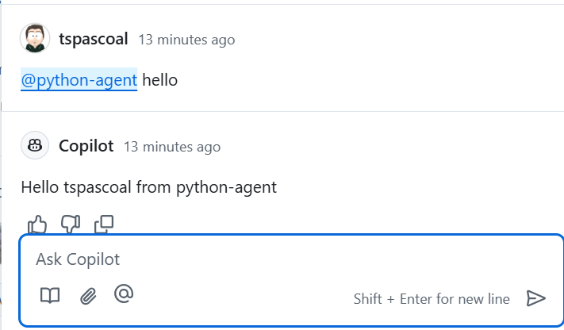

# Hello World Python Copilot Extension

Very Basic Copilot [extension](https://github.com/features/copilot/extensions) implemented in Python.

I'm not a Python person and I'm not claiming this is best way to structure this, all code was written with the help of Copilot, but anything that isn't done the Python way is on me.

All the code does, is receive a prompt (any prompt, doesn't really matter) ignore it, and reply with `Hello USERNAME from EXTENSION NAME`



## Setup Instructions

1. Clone the repository:
   ```
   git clone <repository-url>
   cd hello-world-extension
   ```

2. Create a virtual environment:
   ```
   python -m venv venv
   ```

3. Activate the virtual environment:
   - On Windows:
     ```
     venv\Scripts\activate
     ```
   - On macOS/Linux:
     ```
     source venv/bin/activate
     ```

4. Install the required packages:
   ```
   pip install -r requirements.txt
   ```

## Configuring the Extension and the Application

### Setting up the GitHub Application

Setup the application as described [here](https://docs.github.com/en/copilot/building-copilot-extensions/creating-a-copilot-extension/creating-a-github-app-for-your-copilot-extension) and configuring it for [running copilot](https://docs.github.com/en/copilot/building-copilot-extensions/creating-a-copilot-extension/configuring-your-github-app-for-your-copilot-agent)

There are mostly two things you need to configure:

- `Callback URL` in `General->Identifying and authorizing users` to point to the `/callback-no-oauth` endpoint
- `URL` in `Copilot->Authorization` to point to the `/agent` endpoint.

### Environment Variables

- `SKIP_PAYLOAD_VERIFICATION`: Disables payload verification. This should only be used for testing purposes.
- `COPILOT_AGENT_NAME`: The name of your extension to check if the message is intended for your extension (recommended). If not set, no validation will be performed.

## Usage

To run the application locally, use the following command:
```
flask run
```

The application will be available at `http://127.0.0.1:5000`.

## Endpoints

- **POST /agent**: Accepts JSON data. This endpoint processes the incoming data.
- **GET /callback-no-oauth** Returns a message to inform the user they can now use the Copilot sample. This is called by GitHub OAuth authorization process

## License

This project is licensed under the MIT License.

## Extensions Documentation

If you want to learn more about developing Copilot Extensions, here are some resources

- [Using Copilot Extensions](https://docs.github.com/en/copilot/using-github-copilot/using-extensions-to-integrate-external-tools-with-copilot-chat)
- [About building Copilot Extensions](https://docs.github.com/en/copilot/building-copilot-extensions/about-building-copilot-extensions)
- [Set up process](https://docs.github.com/en/copilot/building-copilot-extensions/setting-up-copilot-extensions)
- [Communicating with the Copilot platform](https://docs.github.com/en/copilot/building-copilot-extensions/building-a-copilot-agent-for-your-copilot-extension/configuring-your-copilot-agent-to-communicate-with-the-copilot-platform)
- [Communicating with GitHub](https://docs.github.com/en/copilot/building-copilot-extensions/building-a-copilot-agent-for-your-copilot-extension/configuring-your-copilot-agent-to-communicate-with-github)

